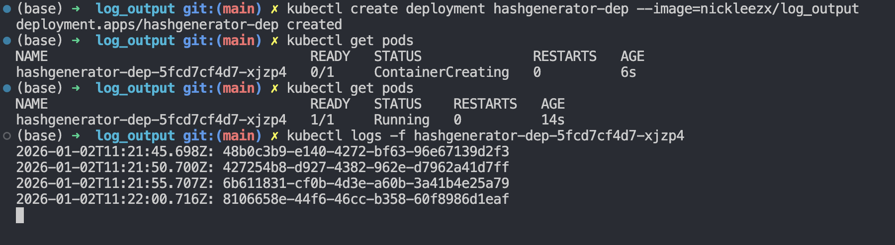
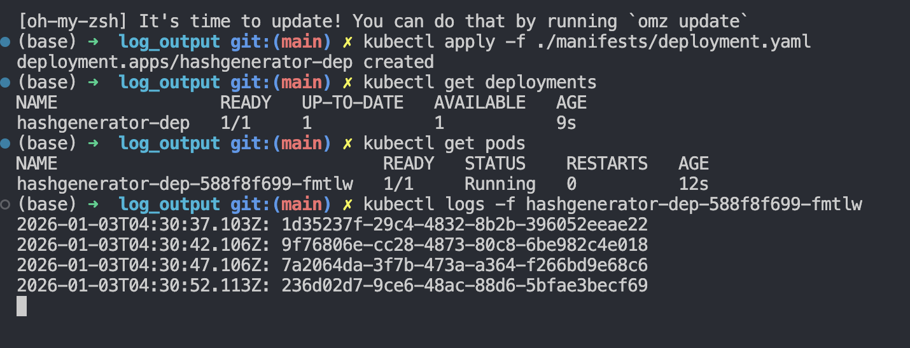
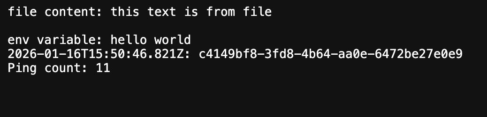

## Exercise 1.1

**Instructions**: Create an application that generates a random string on startup, stores this string into memory, and outputs it every 5 seconds with a timestamp. Deploy it into your Kubernetes cluster and confirm that it's running.

**Solution**:

1. Create kubernetes deployment object

   ```bash
   kubectl create deployment hashgenerator-dep --image=nickleezx/log_output
   ```

2. Check status of deployment

   ```bash
   kubectl get pods
   ```

3. Check logs

   ```bash
   kubectl logs -f hashgenerator-dep-5fcd7cf4d7-xjzp4
   ```

   _Note: replace hashgenerator-dep-5fcd7cf4d7-xjzp4 with pod name_

   

## Exercise 1.3

**Instructions**: In your "Log output" application, create a folder for manifests and move your deployment into a declarative file. Make sure everything still works by restarting and following logs.

**Solution**:

    apiVersion: apps/v1
        kind: Deployment
        metadata:
        name: hashgenerator-dep
        spec:
        replicas: 1
        selector:
            matchLabels:
            app: hashgenerator
        template:
            metadata:
            labels:
                app: hashgenerator
            spec:
            containers:
                - name: hashgenerator
                image: nickleezx/log_output



## Exercise 1.7

**Instructions**: Add an endpoint to request the current status (timestamp and the random string) and an Ingress so that you can access it with a browser.

**Solution**:

1. Update log output app found in [/app](./app/) and create new image

2. Update deployment.yaml of image tag
    ```bash
    apiVersion: apps/v1
    kind: Deployment
    metadata:
      name: hashgenerator-dep
    spec:
      replicas: 1
      selector:
        matchLabels:
          app: hashgenerator
      template:
        metadata:
          labels:
            app: hashgenerator
        spec:
          containers:
            - name: hashgenerator
              image: nickleezx/log_output:0.0.1
              imagePullPolicy: IfNotPresent
              env:
                - name: PORT
                  value: "3002"
    ```

3. Create ingress and service files
    
    ingress.yaml
    ```bash
    apiVersion: networking.k8s.io/v1
    kind: Ingress
    metadata:
      name: hashgenerator-ingress
    spec:
      rules:
        - http:
            paths:
              - path: /
                pathType: Prefix
                backend:
                  service:
                    name: hashgenerator-svc
                    port:
                      number: 1234
    ```

    service.yaml
    ```bash
    apiVersion: v1
    kind: Service
    metadata:
      name: hashgenerator-svc
    spec:
      type: ClusterIP
      selector:
        app:
          hashgenerator
      ports:  
        - port: 1234
          protocol: TCP
          targetPort: 3002
    ```

# Exercise 1.10

**Instructions**: Split the "Log output" application into two different containers within a single pod: 
- One generates a random string on startup and writes a line with the random string and timestamp every 5 seconds into a file.
- The other reads that file and provides the content in the HTTP GET endpoint for the user to see

**Solution**:
1. Update log_output app to save result to file. Found in [log_output](./log-output-app/)

2. Create new app /container that reads the "shared" file within the pod and displays in /file-content. Found in [file-reader](./file-reader-app/)

3. Update `deployment.yaml`, `service.yaml` and `ingress.yaml` found in [manifests](./manifests/)

4. Verify by lanching `localhost:8081/file-content` and exec into file-reader-app container within pod to check if volume was mounted

## Exercise 1.11

**Instructions**: Let's share data between "Ping-pong" and "Log output" applications using persistent volumes. Create both a PersistentVolume and PersistentVolumeClaim and alter the Deployment to utilize it. As PersistentVolumes are often maintained by cluster administrators rather than developers and those are not application specific you should keep the definition for those separated, perhaps in own folder. Save the number of requests to the "Ping-pong" application into a file in the volume and output it with the timestamp and the random string when sending a request to our "Log output" application. In the end, the two pods should share a persistent volume between the two applications. So the browser should display the following when accessing the "Log output" application

**Solution**:

1. Update ping-pong app to save result to file. Found in [ping-pong-app](./ping-pong-app/)

2. Update log_output app to read result from file. Found in [log_output](./log-output-app/)

3. Create `persistentvolume.yaml`, `persistentvolumeclaim.yaml` (PVC) and update `deployment.yaml`

4. Apply the new resources with `kubectl apply -f <relevant files>`

5. Verify by launching `localhost:8081/pingpong` and `localhost:8081`


## Exercise 2.3

**Instructions**: Create a namespace called exercises for the applications in the exercises. Move the "Log output" and "Ping-pong" to that namespace and use that in the future for all of the exercises, except the project that shall have a separate namespace. You can follow the course material using the default namespace.

**Solution**:

1. Create `exercises` namespace within the cluster
    ```bash
    kubectl create namespace exercises
    ```

2. Update `deployment.yaml`, `service.yaml`, `ingress.yaml`, `persistentvolumeclaim.yaml` to include namespace in **metadata** field

3. Run `kubectl apply -f <path to file>`

## Exercise 2.5

**Instructions**:Create a ConfigMap for the "Log output" application. The ConfigMap should define one file information.txt and one env variable MESSAGE. The app should map the file as a volume, set the environment variable and print the content of those in addition to the usual output:

**Solution**:

1. Create the [configmap.yaml](./manifests/configmap.yaml) file
2. Update log_ouput app to read the env variable and config file
3. Deploy kubernetes resources including configmap
4. Test at localhost:8081



## Exercise 2.7

**Instructions**: Run a Postgres database as a stateful set (with oen replica) and save the Ping-pong application counter into the database.

**Solution**:

1. Create `statefulset.yaml` with stateful set and its headless service

    1.1. Create the necessary secret.yaml (*not commited to version control*) that postgres and our app uses for administration (user, password, database)
2. Update [ping pong app](./ping-pong-app/) to connect to database
3. Update [deployment](./manifests/deployment.yaml) of ping-pong-app to use env variables from secret and database connection configuration
4. Deploy and test

     4.1 (optional) Verify by executing into the kubectl pod and the psql statefulset to query the DB 