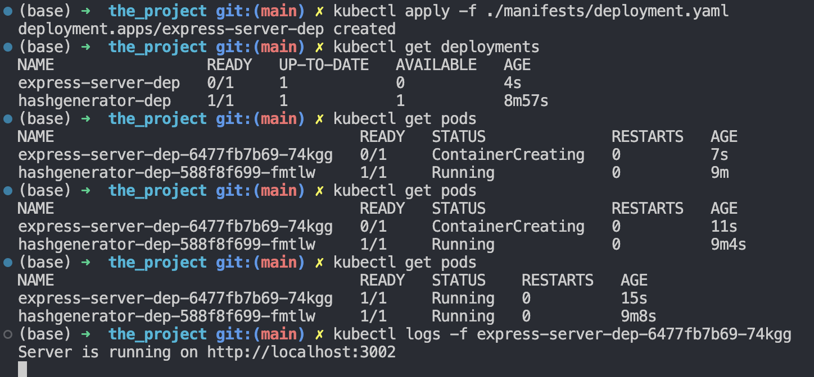
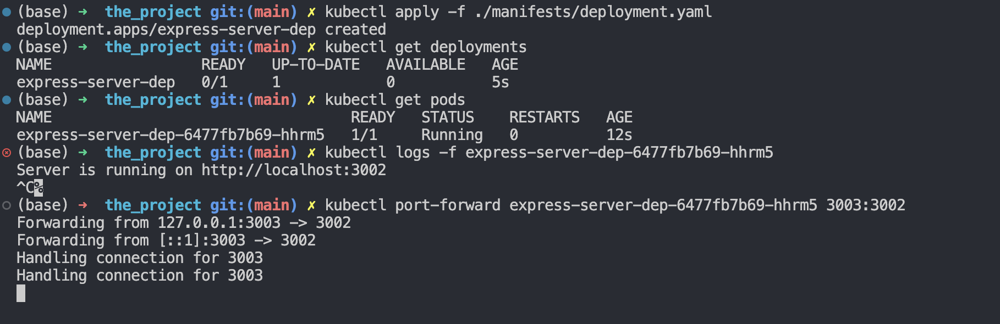

## Exercise 1.2

**Instructions**: Create a web server that outputs "Server started in port NNNN" when it is started and deploy it into your Kubernetes cluster. Please make it so that an environment variable PORT can be used to choose the used port. You may call the server todo app since it will, amongst other things, provide the functionality of a todo application pretty soon.

**Solution**

1. Create kubernetes deployment object
   ```bash
   kubectl create deployment server-dep --image=nickleezx/the_project:0.0.1
   ```
2. Check status of deployment

   ```bash
   kubectl get pods
   ```

3. Check logs

   ```bash
   kubectl logs -f server-dep-bdcddb694-fjdlj
   ```

   _Note: replace server-dep-bdcddb694-fjdlj with pod name_

   

## Exercise 1.4

**Instructions**: Create a deployment.yaml for the course project (that you started in Exercise 1.2.)

**Solution**:

    apiVersion: apps/v1
    kind: Deployment
    metadata:
      name: express-server-dep
    spec:
      selector:
        matchLabels:
          app: express-server
      template:
        metadata:
          labels:
            app: express-server
        spec:
          containers:
            - name: myapp
              image: nickleezx/the_project



## Exercise 1.5

**Instructions**: Make the project respond something to a GET request sent to the / url of the project. A simple HTML page is good, or you can deploy something more complex, like a single-page application.

**Solution**:



## Exercise 1.6

**Instructions**: Use a NodePort Service to enable access to the project.

**Solution**:

1. Create cluster with local port forwarded to node port
    ```bash
    k3d cluster create --port 8082:30080@agent:0 -p 8081:80@loadbalancer --agents 2
    ```

2. Deploy the application
    ```bash
    kubectl apply -f ./manifests/deployment.yaml  
    ```

3. Deploy the service
    ```bash
    kubectl apply -f ./manifests/service.yaml
    ```

4. Verify application and service running by visiting local port mapped to node
    ```bash
    http://localhost:8082
    ```

## Exercise 1.8

**Instructions**: Switch to using Ingress instead of NodePort to access the project. You can delete the Ingress of the "Log output" application so they don't interfere with this exercise. We'll look more into paths and routing in the next exercise, and at that point, you can configure the project to run with the "Log output" application side by side.

**Solution**:

1. Update ```service.yaml``` to use a cluster IP as identification 
    ```bash
    apiVersion: v1
    kind: Service
    metadata:
      name: express-server-svc
    spec:
      type: ClusterIP
      selector: 
        app: express-server
      ports:
        - protocol: TCP
          port: 1234
          targetPort: 3002    
    ```

2. Create an ingress
    ```bash
    apiVersion: networking.k8s.io/v1
    kind: Ingress
    metadata:
      name: express-server-ingress
    spec:
      rules:
        - http:
            paths:
            - path: /
              pathType: Prefix
              backend:
                service:
                  name: express-server-svc
                  port: 
                    number: 1234
    ```

## Exercise 1.12

**Instructions**: Get a random picture from Lorem Picsum like https://picsum.photos/1200 and display it in the project. Find a way to store the image so it stays the same for 10 minutes. After 10 minutes have passed, you might give the old pic still one more time, and for the next request, there should be a new picture. Make sure to cache the image into a volume so that the API isn't needed for new images every time we access the application or the container crashes.

**Solution**: 

1. Create a frontend that will ping the backend for image. Found in [frontend/](./frontend/)

2. Update [backend](./backend/) to download image and save to drive

3. Update kubernetes resources (`persistentvolumeclaim.yaml`, `deployment.yaml`, `ingress.yaml`, `service.yaml`)

4. Deploy on cluster and test by going to `localhost:8081` and `localhost:8081/api/images. Stop the deployment pod and check after 10 minutes to see changes.

## Exercise 2.4

**Instructions**: Create a namespace called project for the project and move everything related to the project to that namespace. Use the new namespace in the future for all the project related exercises.

**Solution**:

1. Create `project` namespace within the cluster
    ```bash
    kubectl create namespace project
    ```

2. Update `deployment.yaml`, `service.yaml`, `ingress.yaml`, `persistentvolumeclaim.yaml` to include namespace in **metadata** field

3. Run `kubectl apply -f <path to file>`

## Exercise 2.6

**Instructions**: Make sure that your project has no hard coded ports, URL or other configurations in the source code. Pass all the configurations to pods as env variables that are defined either in a config map or in deployments.

**Solution**:

1. Update frontend such that it replaces the `BACKEND_URL` via entrypoint.sh, replacing the hardcoded string values in build files in `/dist` to the ENV variables passed via config map

2. Create `configmap.yaml` and update `deployment.yaml` to use configmap

3. Deploy and test