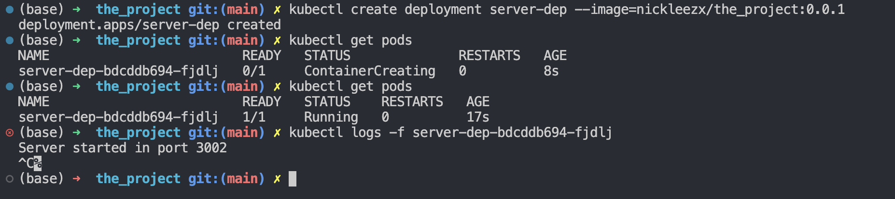

## Exercise 1.2

**Instructions**: Create a web server that outputs "Server started in port NNNN" when it is started and deploy it into your Kubernetes cluster. Please make it so that an environment variable PORT can be used to choose the used port. You may call the server todo app since it will, amongst other things, provide the functionality of a todo application pretty soon.

**Solution**

1. Create kubernetes deployment object
    ```bash
    kubectl create deployment server-dep --image=nickleezx/the_project:0.0.1
    ```
2. Check status of deployment
    ```bash
    kubectl get pods
    ```

3. Check logs
    ```bash
    kubectl logs -f server-dep-bdcddb694-fjdlj
    ```
    _Note: replace server-dep-bdcddb694-fjdlj with pod name_

    